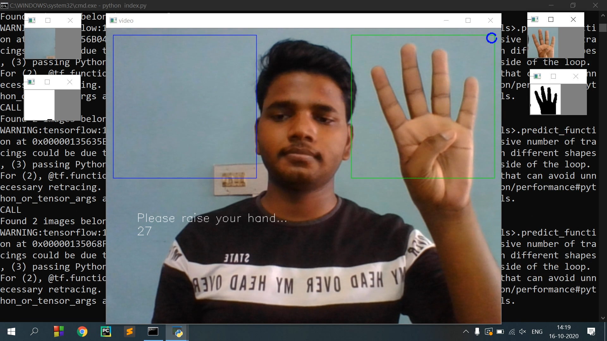

<h1 align="center"> Hand-Gesture </h1>
<h3>Introduction</h3>

<strong>In this project user can input pin code of any district by showing his hand</strong><br>
For input we use webcam to take live video input of user. User can input number by showing his/her fingers for all 6 digits one by one (one digit at a time) with the help of machine learning program will automatically count how many finger user is showing. After 6-digit number is generated it will show the result.<br>
<strong>NOTE:-</strong>there are two boxes if you need to enter number >5 than use both boxes one hand in each else if you need to enter number <5 you can use any of the boxes <br> 

<h3><a href="https://youtu.be/CJhNlMBcW_w">https://youtu.be/CJhNlMBcW_w</a></h3><br>
<a href="https://youtu.be/CJhNlMBcW_w"><strong>Youtube video of results</strong></a><br>
<a href="https://youtu.be/CJhNlMBcW_w"></a>

<h3>Description of all files</h3>
<h5>index.py</h5>

It is the central file that takes input and shows the output. By this code, input from the webcam is taken and extracts the region of hand and prepares image suitable for prediction and then calls a suitable function to make a prediction and show the result.

<h5>addon_function.py</h5>

It will contain all function which is used by index.py, use to organize the code

<h5>Set_HSV_values.py</h5>

When this code will runs, 3 windows are open, One will show normal video of input, 2nd window will show B&W video, and 3rd window will show 7 trackbars, you can play with the first 6 trackbars to get a good B&W video of yours in which your hand is properly distinctable. When it has done then close it. <br>
NOTE:- If you want to reset all values then click on the reset trackbar.

<h5>model.py</h5>

This part of the code will contain everything which needs to train our model.

<h5>gen_image.py</h5>

It is used to take images of the respective class and save it to the proper place. when you press any key between 0 to 6 it will take an image of the region of interest and save it to the corresponding folder. let us assume key 3 is press then it will take the image and save it to a folder whose image corresponds to number 3.
keypress:-
0		- for zero
1		- for one
2		- for two
3		- for three
4		- for four
5		- for five
6		- for random images


<h5>data</h5>

this folder contain pin code data sheet, hsv values text file and exit message.

<h5>model</h5>

this folder contain architecture of current model and weight of parameters

<h5>images</h5>

this folder will contain all images use to train model.


<br>

<h3>Required Packages</h3>

```bash
- OpenCV-python
- Numpy
- Pandas
- Tensorflow 
```
<br>


<h3>1 Getting Started</h3>


<h3>1.1 Installation</h3>

   
1. Clone this repository
   
```bash
git clone https://github.com/iTs-rd/hand-gesture.git
```
   
2. Install the required packages
```bash
cd hand-gesture
pip install -r requirements.txt
```
<strong>If above code do not work replace pip by pip3.</strong><br>
It will install everything you need. If you have already installed some of the required packages it will skip that.

<h3>1.2 Check your present condition </h3>

First of all, You have to check your hand is properly detected or not.

```bash
python Set_HSV_values.py
```

It will open 3 windows, One will show normal video of input, 2nd window will show B&W video, and 3rd window will show 7 trackbars, you can play with the first 6 trackbars to get a good B&W video of yours in which your hand is properly distinctable. When it has done then close it.
<strong>Note:-</strong> If you want to reset all values then click on reset trackbar.

<strong>If all done the program is ready to run</strong>

<h3>1.3 Run program</h3>

To run the program simply enter this line

```bash
python index.py
```


<h3>summary</h3>

Run these code line by line

```bash
git clone https://github.com/iTs-rd/hand-gesture.git
cd hand-gesture
pip install -r requirements.txt
python Set_HSV_values.py
python index.py
```

<br><h4>Special Thanks to Rohit Jain</h4>
<h3>Contacts</h3>
Email- Rudresh.gupta.che19@iitbhu.ac.in <br>
Linkedin- https://www.linkedin.com/in/rudresh-gupta-b87a84190
